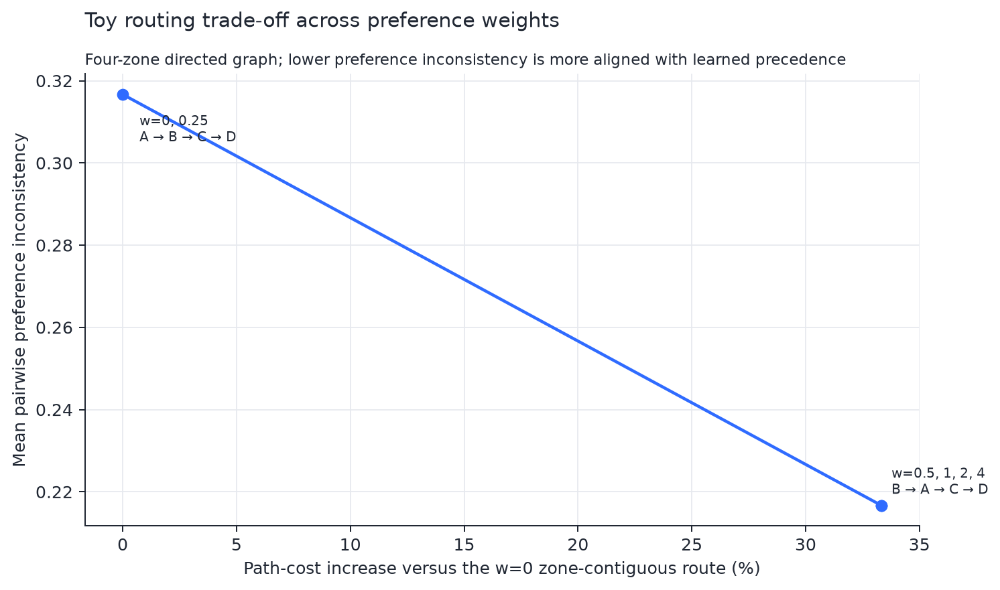
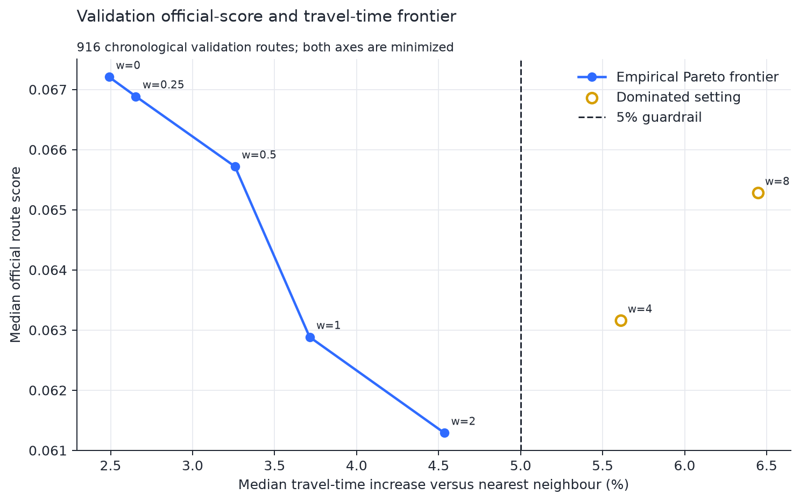
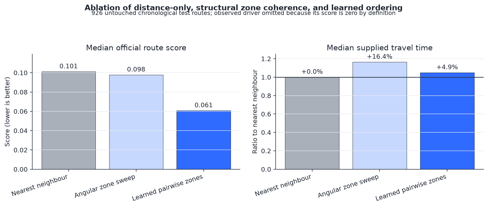

# Learning-Augmented Human-Centric Last-Mile Routing

How should a route planner trade a small amount of travel efficiency for stronger agreement with delivery-zone patterns learned from experienced drivers?

This independent research project studies that question on 6,112 historical routes from the public 2021 Amazon Last Mile Routing Research Challenge. Its focus is not a single leaderboard number: the repository develops an interpretable mathematical decision rule, uses toy examples to explain its limiting behaviour, traces the empirical Pareto frontier, separates structural constraints from learned preferences, and evaluates the locked model on untouched chronological test routes.

## Research question

Can station-conditioned pairwise zone-order preferences improve driver-sequence similarity relative to distance-only routing while keeping the travel-time cost within a predeclared operational guardrail?

The project treats this as a learning-augmented bi-criteria routing problem:

- travel efficiency is measured using supplied directed travel times;
- behavioral consistency is measured using learned zone precedence and multiple sequence metrics;
- model selection occurs only on chronological validation routes;
- the final test set is untouched until the preference weight is frozen.

## Mathematical idea

For station \(s\) and zones \(a,b\), the smoothed probability that \(a\) precedes \(b\) is

$$
\widehat p_s(a\prec b)
=
\frac{N_s(a\prec b)+\alpha}
     {N_s(a\prec b)+N_s(b\prec a)+2\alpha}.
$$

Sparse exact-zone estimates back off to station-level parent zones, global parent zones, and finally the neutral probability \(0.5\).

At a routing decision with current stop \(i\) and remaining zones \(R\), candidate zone \(q\) receives the local score

$$
J_w(q\mid i,R)
=
\underbrace{
\frac{\min_{j:z(j)=q}d_{ij}}
{\operatorname{median}_{r\in R}\min_{j:z(j)=r}d_{ij}}
}_{\text{normalized directed travel}}
+
w
\underbrace{
\left[
1-\frac{1}{|R|-1}
\sum_{r\in R\setminus\{q\}}\widehat p_s(q\prec r)
\right]
}_{\text{pairwise preference penalty}}.
$$

The lowest-scoring zone is selected greedily, then all stops in that zone are exhausted by nearest neighbour. Consequently:

- \(w=0\) is a zone-contiguous distance heuristic, not stop-level nearest neighbour;
- increasing \(w\) gives learned precedence more influence;
- the procedure is interpretable but has no global optimality guarantee;
- zero zone re-entry comes from zone exhaustion, while learning determines the order of the zone blocks.

## What the trade-off analysis shows

### 1. Stronger preference is not always better

On 916 chronological validation routes, weight \(w=2\) lies inside the predeclared 5% median travel-time guardrail and minimizes the selected disagreement criterion among eligible settings.

Weights \(w=4\) and \(w=8\) continue to reduce preference disagreement, but both exceed the guardrail and worsen the official route score. They are empirically dominated by \(w=2\): they cost more travel time and produce a worse score.

### 2. Zone coherence and learned ordering are different contributions

Nearest neighbour operates at stop level and has 21 median zone re-entries. Both angular zone sweep and learned pairwise-zone routing exhaust each selected zone and therefore have zero median re-entry.

The angular baseline demonstrates that contiguity alone is insufficient:

| Method | Median official score | Median supplied travel time | Median zone re-entries |
|---|---:|---:|---:|
| Nearest neighbour | 0.1011 | 11,188.8 s | 21 |
| Angular zone sweep | 0.0978 | 13,021.5 s | 0 |
| Learned pairwise zones | **0.0607** | 11,740.0 s | 0 |

The learned method produces substantially better sequence agreement than the structural zone baseline while requiring much less travel inflation.

### 3. Untouched test performance remains broad-based

The preference weight was selected on validation data and evaluated once on 926 untouched chronological test routes.

| Confirmatory quantity | Result |
|---|---:|
| Aggregate median official-score reduction vs nearest neighbour | **39.9%** |
| Routes with lower official score | **88.1%** |
| Paired median official-score difference | **-0.0421** |
| Route-bootstrap 95% interval for paired median difference | **[-0.0450, -0.0404]** |
| Paired median travel-time increase | **4.83%** |
| Median zone re-entry change | **21 to 0** |

These are behavioral-imitation and predictive evaluation results. They are not causal evidence about driver workload, safety, fuel use, or delivery success.

## Notebook-first research walkthrough

The notebooks are the primary reader-facing artifacts:

1. [Mathematical formulation and trade-offs](notebooks/00_mathematical_formulation_and_tradeoffs.ipynb)
   Derives the local decision rule, implements the complete toy optimizer in-notebook, explains limiting cases and complexity, identifies the empirical Pareto frontier, and separates structural zone coherence from learned ordering.

2. [Data quality and experimental population](notebooks/01_data_quality_audit.ipynb)
   Audits route volume, station coverage, stop-count distributions, sequence validity, and the chronological population used by the study.

3. [Confirmatory results and robustness](notebooks/02_confirmatory_results.ipynb)
   Recomputes validation selection, paired test results, bootstrap uncertainty, route-level operational trade-offs, and station heterogeneity.

Supporting materials:

- [Research protocol](docs/research_protocol.md)
- [Chart contracts](docs/chart_contracts.md)
- [CV and interview notes](docs/cv_and_interview_notes.md)
- [Self-contained technical report](report/report.html)

Reusable modules and tests remain in the repository for auditability, but the notebooks expose the mathematical logic and research interpretation directly.

## Experimental design

- 6,112 historical routes from 17 delivery stations.
- Station-aware chronological split: 4,270 train / 916 validation / 926 test.
- Training-only estimation of exact-zone, parent-zone, and global pairwise preferences.
- Validation-only selection from seven declared preference weights.
- Predeclared median travel-time guardrail of 5% versus nearest neighbour.
- Untouched test evaluation with the official challenge score, pairwise disagreement, adjacent-edge recall, supplied travel time, and zone re-entry.
- Route-level bootstrap uncertainty and descriptive station heterogeneity.

## Reproduce the notebook story

The mathematical notebook and its committed empirical summaries can be rerun without downloading the raw dataset:

    python -m venv .venv
    .\.venv\Scripts\Activate.ps1
    python -m pip install -e ".[dev]"
    python scripts/create_mathematical_notebook.py
    python -m jupyter nbconvert --execute --to notebook --inplace notebooks/00_mathematical_formulation_and_tradeoffs.ipynb

To reproduce the complete raw-data experiment:

    python scripts/download_data.py --bundle training
    python scripts/run_travel_time_experiment.py
    python scripts/create_results_notebook.py
    python -m jupyter nbconvert --execute --to notebook --inplace notebooks/02_confirmatory_results.ipynb

The repository retains automated tests and reproducibility checks, while raw Amazon files and route-level experiment outputs remain excluded from version control.

## Limitations and open research questions

- The algorithm is greedy and does not solve a global vehicle-routing formulation.
- Pairwise preference estimates may be non-transitive.
- Historical driver sequences are demonstrations, not verified optimal routes.
- Zone exhaustion guarantees contiguity but may be inappropriate when time windows require returning to a zone.
- Package time windows and service durations are not hard feasibility constraints.
- The official sequence-deviation formula has permutation edge cases, so findings are triangulated across several metrics.
- The data cover a short 2018 window and 17 US stations; external validity is untested.
- A future mixed-integer or robust optimization model could compare global and greedy Pareto frontiers under time-window feasibility.

## Data and licensing

The dataset is available through the [Registry of Open Data on AWS](https://registry.opendata.aws/amazon-last-mile-challenges/) under CC BY-NC 4.0.

Merchán, D., Arora, J., Pachon, J., Konduri, K., Winkenbach, M., Parks, S., and Noszek, J. (2022). *2021 Amazon Last Mile Routing Research Challenge: Data Set*. Transportation Science. https://doi.org/10.1287/trsc.2022.1173

The official scoring code was adapted from the MIT-licensed MIT-CAVE rc-cli implementation and is attributed in src/lastmile/official_score.py. Repository code is MIT-licensed; the dataset retains its original license.
