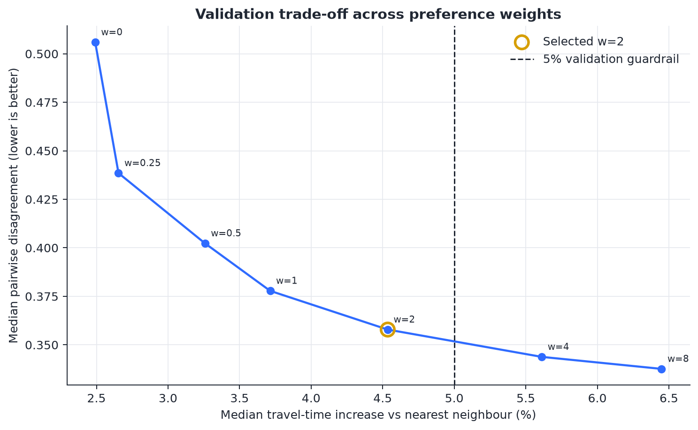

# Learning from Drivers for Human-Centric Last-Mile Routing

[](https://github.com/bhavishjain7133/learning-augmented-last-mile-routing/actions/workflows/ci.yml)
[](https://www.python.org/)
[](LICENSE)

Can a route planner learn tacit zone-ordering preferences from experienced drivers without materially increasing travel time?

This project answers that question with an interpretable learning-augmented routing model on the public **2021 Amazon Last Mile Routing Research Challenge** data. The model learns station-specific pairwise zone precedence, backs off hierarchically when evidence is sparse, and combines those preferences with the supplied directed travel-time matrices.

## Confirmatory result

The preference weight was selected on 916 chronological validation routes under a predeclared guardrail: median supplied-travel-time increase had to remain at or below 5% versus nearest-neighbour routing. The selected weight (`2.0`) was then evaluated once on 926 untouched test routes.

| Test metric | Nearest neighbour | Learned pairwise-zone model |
|---|---:|---:|
| Official Amazon route score, median (lower is better) | 0.1011 | **0.0607** |
| Normalized pairwise disagreement, median | 0.4953 | **0.3343** |
| Supplied travel time, median | **11,188.8 s** | 11,740.0 s |
| Zone re-entries, median | 21 | **0** |

The learned model reduced the aggregate median official score by **39.9%**, improved the official score on **88.1%** of test routes, and incurred a **4.83%** paired median travel-time increase. The paired median official-score difference was `-0.0421`; a 10,000-resample route bootstrap gave a 95% interval of `[-0.0450, -0.0404]`.

These are predictive/behavioral-imitation results, not causal evidence about driver workload or delivery success.



*Validation-only selection: weight 2 is the strongest setting inside the predeclared 5% median travel-time guardrail.*

## Study design

- 6,112 historical routes from 17 delivery stations.
- Station-aware chronological split: 4,270 train / 916 validation / 926 test.
- Training-only estimation of exact-zone, parent-zone, and global pairwise preferences.
- Validation-only hyperparameter selection.
- Untouched test evaluation with the official Amazon challenge scorer, travel time, pairwise disagreement, adjacent-edge recall, zone re-entry, and runtime.
- Streamed processing of the 1.8 GB supplied travel-time file rather than loading it into memory.

## Main artifacts

- `notebooks/01_data_quality_audit.ipynb` — executed data audit.
- `notebooks/02_confirmatory_results.ipynb` — executed validation/test analysis with uncertainty and station cuts.
- `report/report.html` — self-contained technical report with live charts and no-JavaScript fallbacks.
- `docs/research_protocol.md` — leakage controls, hypotheses, metrics, and scope.
- `docs/cv_and_interview_notes.md` — concise, defensible project wording.
- `artifacts/confirmatory_results/` — chart inputs, figures, and headline metrics.

## Reproduce

```powershell
python -m venv .venv
.\.venv\Scripts\Activate.ps1
python -m pip install -e ".[dev]"
python scripts/download_data.py --bundle training
pytest
python scripts/run_travel_time_experiment.py
python scripts/create_results_notebook.py
jupyter nbconvert --to notebook --execute notebooks/02_confirmatory_results.ipynb --inplace
python scripts/build_html_report.py
python "<data-analytics-plugin>/skills/build-report/scripts/embed_html_report_runtime.py" --input report/report-shell.html --payload report/report-payload.json --output report/report.html
```

Data files are gitignored and are not redistributed. SHA-256 hashes and the exact selection rule are saved in `artifacts/travel_time_experiment/run_metadata.json`.

## Limitations

- Observed driver routes are demonstrations, not verified optimal routes.
- Package time windows and service duration are not yet hard feasibility constraints.
- The data cover a short 2018 window and 17 US stations; external validity is untested.
- The official sequence-deviation formula has permutation edge cases (including an exact reverse traversal with zero deviation), so conclusions are triangulated across several metrics.
- Station-level results are descriptive and should not be treated as pre-registered subgroup hypotheses.

## Data and licences

The dataset is available through the [Registry of Open Data on AWS](https://registry.opendata.aws/amazon-last-mile-challenges/) and is licensed separately under CC BY-NC 4.0. The dataset citation is:

Merchán, D., Arora, J., Pachon, J., Konduri, K., Winkenbach, M., Parks, S., and Noszek, J. (2022). *2021 Amazon Last Mile Routing Research Challenge: Data Set*. Transportation Science. https://doi.org/10.1287/trsc.2022.1173

The official scoring code was adapted from the MIT-licensed MIT-CAVE `rc-cli` implementation and is attributed in `src/lastmile/official_score.py`.

